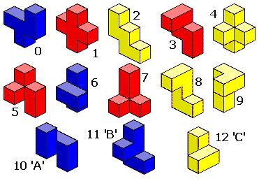

# Puzzle Cubes

## Goals

-   [ ] Create a solver for the Bedlam Cube
-   [ ] Parrallelize the solver
-   [ ] Allow for other similar puzzles to be solved

## References

-   [Bedlam Cube](https://en.wikipedia.org/wiki/Bedlam_Cube) Wikipedia
-   [Scott Kurowski](http://www.scottkurowski.com/BedlamCube/) Bedlam Cube Solver
